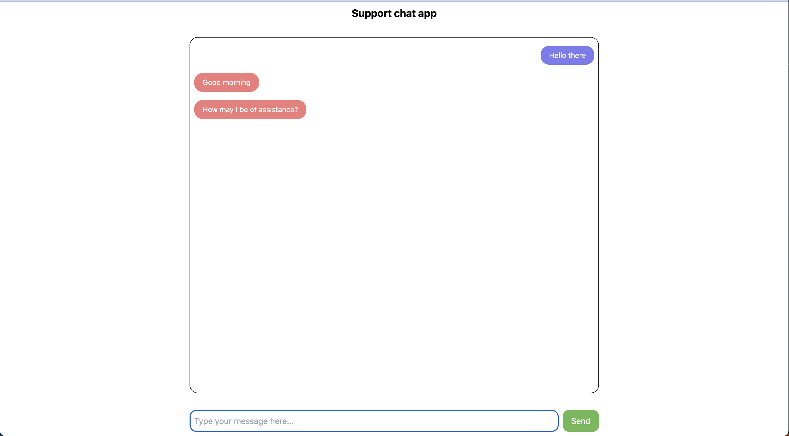
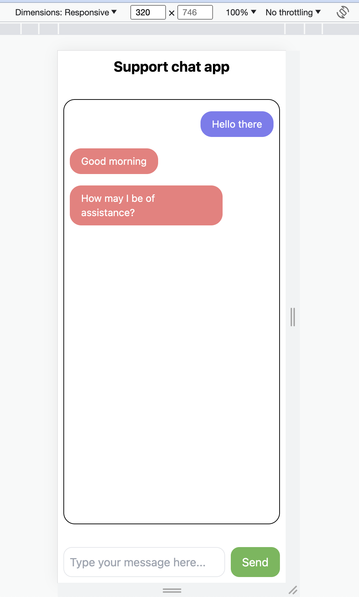
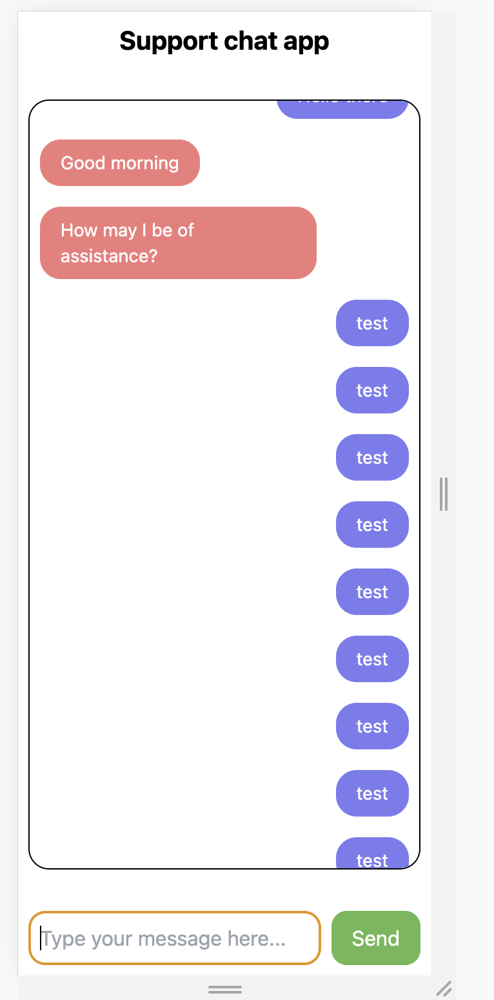
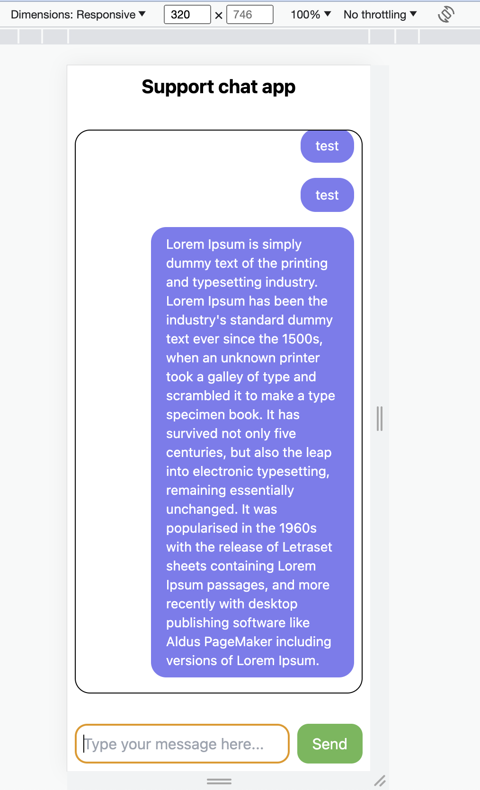
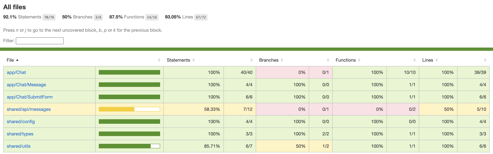
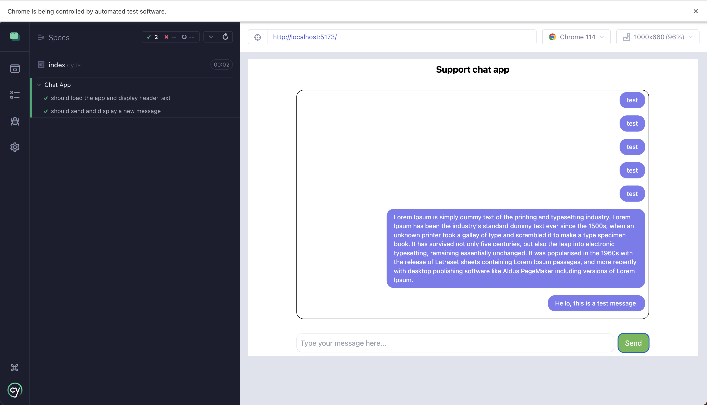

# [simple-chat-fe](https://simple-chat-fe.vercel.app/)

(reach out to me if there are server errors in the link or scroll down to run
locally)

This is a simple chat frontend application built using Vite, React, and other
related dependencies. It allows users to send and receive messages in a
chat-like interface.

## Getting Started

To get started with the development or usage of this application, follow the
steps below:

### Prerequisites

Make sure you have Node.js and yarn installed on your machine.

### Installation

1. Clone the repository to your local machine:

```bash
git clone <repository_url>
```

2. Navigate to the project directory:

```bash
cd simple-chat-fe
```

3. Install the project dependencies:

```bash
yarn install
```

### Development

To start the development server, run the following command:

```bash
yarn run dev
```

This will start the Vite development server, and you can access the application
in your browser.

### Building

To build the application for production, run the following command:

```bash
yarn run build
```

This will create an optimized production build of the application in the `dist`
directory.

### Testing

To run unit tests, use the following command:

```bash
yarn test
```

To run end-to-end tests with Cypress, use:

```bash
yarn test:e2e
```

### Linting

To lint the project for code quality and consistency, use the following command:

```bash
yarn lint
```

## Dependencies

This application relies on the following main dependencies:

- [axios](https://www.npmjs.com/package/axios): For making API requests to a
  backend server.
- [react](https://reactjs.org/): A JavaScript library for building user
  interfaces.
- [react-simple-toasts](https://www.npmjs.com/package/react-simple-toasts): A
  simple toast notification library for React.

For development and testing, the application also includes various development
dependencies such as:

- [cypress](https://www.cypress.io/): A powerful end-to-end testing framework.
- [eslint](https://eslint.org/): A code linting tool for identifying and fixing
  common errors and inconsistencies in code.
- [jest](https://jestjs.io/): A testing framework for JavaScript and TypeScript
  applications.
- [typescript](https://www.typescriptlang.org/): A superset of JavaScript that
  adds static typing to the language.
- [vite](https://vitejs.dev/): A fast and lightweight development server and
  build tool for modern web projects.

Please refer to the `package.json` file for a complete list of all dependencies
and their versions.

## Screenshots









## Unit test coverage



## e2e tests



## License

This project is licensed under the [MIT License](LICENSE).
